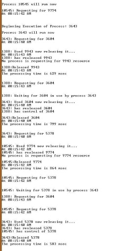
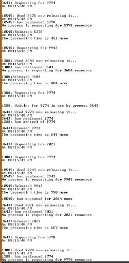

# Operating System Simulation by scheduling process-resource and Deadlock prevention

## Aim:  
Operating System Simulation by scheduling process-resource and Deadlock prevention

## Problem Definition:

Operating System Simulation by scheduling process-resource and preventing Deadlock. Simulation is the imitation of the operation of a real-world process or system over time. Similarly, Operating System Simulation is implementation of various functionalities of an Operating System some of which includes process management, process scheduling, process synchronization, Deadlock prevention, Deadlock detection, Deadlock recovery, Memory management, file management, Input/Output management and many more. One of the primary functions of an Operating System include scheduling of various processes and prevent deadlock conditions. Our project intends to demonstrate these  operations of an Operating System by creating a primitive form of an Operating System primarily based on Java. 

A typical process involves usage of number of resources. In multiprogramming systems, one process can use CPU while another is waiting for a resource,  working with CPU for a long time, has a higher priority than the currently working process or some other reason. This is possible only with process scheduling.There are various scheduling algorithms developed. Some of them include FCFS (First-Come-First-Serve), SJF (Shortest Job First), Priority Scheduling, Round Robin algorithm, Multilevel Queue, Multilevel Feedback Queue, etc. This project simulates hybrid of pre-emptive Priority algorithm and Round Robin algorithm for process scheduling. 

Deadlock is indefinite blocking of set of processes which are communicating with each other or competing for resources. Deadlock handling involves deadlock prevention, deadlock avoidance, deadlock detection and deadlock recovery. In this project, deadlock is prevented by preventing Hold and Wait condition i.e. each process is allowed to hold on with only one resource at a time and release the resource before acquiring another resource. Also the time each resource is acquired by a process is limited to 500 msec which prevents starvation of processes.
	
## Introduction and methods:

### OS Simulation Project

A main class creates n process with different priorities (n and priority entered by user, n<=10). Each process thread then begins its process in parallel with respect to their priorities. The main task of each process is to request a resource, wait for the resource if not available, acquire the resource, use the resource, release the resource and assign to another process waiting for the resource. This assignment is based on FIFO principle. Each process is assigned random number of resources ( same or different ) from 2 to 5. Each process maintains a list of  resources.  Similarly, each resource maintains a list of processes requesting for a particular resource. 

A Priority Queue is maintained and the processes are entered into the queue as per their priority. A process initially requests for a resource. If the resource is being held by another process then the current process enters the queue of the resource. If the resource is free, then the process uses the resource, releases it and assigns it to another process (if present in the queue of the resource else declares the resource to be free). The resource is held for random amount of time( from 400 to 500 msec). The time each process holds up the resource is displayed and the total processing time of the process is computed and displayed at the end of each process.  

## New Java concepts used:
This project mainly uses the concept of multithreading and classes in Collection framework. 

## Multithreading:
Multithreading in Java is a process of executing multiple threads simultaneously. Thread is basically a lightweight sub-process, a smallest unit of processing. 
There are two ways to create a thread:
	1. By extending Thread class
	2. By implementing Runnable interface.	
In this project, the thread is created by implemeting the Runnable interface. Runnable interface has only one method named run() which must be defined compulsorily defined by the class implementing Runnable. 
	public void run(): It is used to perform action for a thread.
	
## Collection Class:
Collections in Java is a framework that provides an architecture to store and manipulate the group of objects. All the operations performed on a data such as searching, sorting, insertion, manipulation, deletion etc. can be performed by Java Collections. Java Collection simply means a single unit of objects. Java Collection framework provides many interfaces (Set, List, Queue, Deque etc.) and classes (ArrayList, Vector, LinkedList, PriorityQueue, HashSet, LinkedHashSet, TreeSet etc). In  this project, PriorityQueue, LinkedList and Queue are the collections used. 
Java LinkedList class
			
Java LinkedList class uses doubly linked list to store the elements. It provides a linked-list data structure. It inherits the AbstractList class and implements List and Deque interfaces.
Java Queue Interface

Java Queue interface orders the element in FIFO(First In First Out) manner. In FIFO, first element is removed first and last element is removed at last.
PriorityQueue class

The PriorityQueue class provides the facility of using queue. But it does not orders the elements in FIFO manner. It inherits AbstractQueue class. The elements of the priority queue are ordered according to their natural ordering, or by a Comparator provided at queue construction time, depending on which constructor is used. The head of this queue is the least element with respect to the specified ordering. If multiple elements are tied for least value, the head is one of those elements -- ties are broken arbitrarily. 

The following constructor is used to store Process objects as per their priorities.
		public PriorityQueue(int initialCapacity, Comparator<? super E> comparator)
This constructor creates a PriorityQueue with the specified initial capacity that orders its elements according to the specified comparator.

# Output Screenshots

The output would vary because of use of random function.

